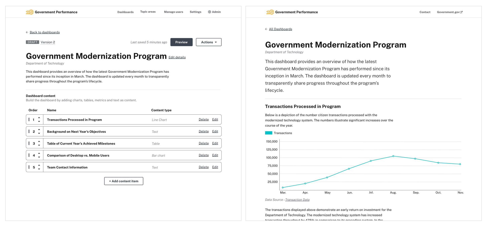

# Performance Dashboard on AWS


<p align="center">
  
</p>

Performance Dashboard on AWS (PDoA) is a solution for national, municipal, and local governments to publish and visualize their data, so it can be easily shared internally and externally. This cost-effective solution presents digital service performance and other metrics in an accessible, clear, and open way. Performance Dashboard on AWS allows users to customize dashboards to visually demonstrate efficiencies achieved such as the processing of driver license applications or how citizenship statistics have changed over time. Dashboards clearly present performance data to meet the needs of data users including digital leaders, service owners, and the public.

Performance Dashboard on AWS is setup by running its CloudFormation template. This will create an instantiation of the solution. The architecture diagram provides an overview of what will be built:

<p align="center">
  
</p>

## Key Features

Below are a few key features of the Performance Dashboard:

- Users can configure dashboards to visualize data in easy-to-understand ways through the use of charts and tables. The pairing of modern data visualizations and text features help governments share their data-driven findings.
- A supportive workflow guides users through dashboard creation step-by-step, from creating an initial draft to archiving a published dashboard.
- Built with AWS serverless technology, the system is designed to keep costs at a minimum by only incurring costs when your dashboard is actively being used.

To access additional details on the system's features and workflows, please view the [user guide](docs/user-guide.pdf).

## Getting Started

### Launch Solution

PDoA comes with pre-built code to provision an instance in your AWS account. You can use the provided AWS CloudFormation [template](docs/installation.md#-deploying-with-aws-cloudformation-template) (CFT) to install PDoA in a few clicks. If you're in a developer or techops role and want to update or experiment with the source code, the provided AWS Cloud Development Kit (CDK) [script](docs/installation.md#deploying-with-aws-cloud-development-kit-cdk) makes it easy to deploy your changes. If you're already familiar with deploying resources on AWS using CFT, click the link below to deploy in the us-east-1 region. Refer to the [installation guide](docs/installation.md) for more detailed instructions.

| Region               | Launch                                                                                                                                                                                                                                                                                                                             |
| -------------------- | ---------------------------------------------------------------------------------------------------------------------------------------------------------------------------------------------------------------------------------------------------------------------------------------------------------------------------------- |
| Install in us-east-1 | [](https://console.aws.amazon.com/cloudformation/home?region=us-east-1#/stacks/quickcreate?templateURL=https://performance-dashboard-on-aws-solution-releases-us-west-2.s3.us-west-2.amazonaws.com/performance-dashboard-on-aws/v1.0.3/performance-dashboard-on-aws.template) |

### Clone this repository

The mainline branch of this repository develops rapidly. If you want to obtain the latest stable copy of the code, clone this repository using the tag of the most recent release, which currently is 1.0.3.

```
$ git clone -b 1.0.3 https://github.com/awslabs/performance-dashboard-on-aws.git
```

## Security

See [CONTRIBUTING](CONTRIBUTING.md#security-issue-notifications) for more information.

## Want to contribute?

See [CONTRIBUTING](CONTRIBUTING.md) for more information.

## License

This project is licensed under the Apache-2.0 License.

## Feedback

We're currently collecting feedback on Performance Dashboard on AWS to ensure the product meets your needs. If you would like to share your thoughts, we'd love to hear from you. Reach out to us at wwps-performance-dashboard@amazon.com.
