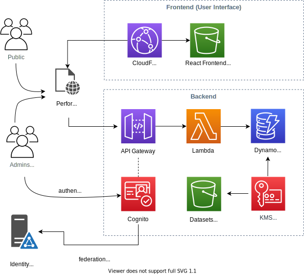

# Performance Dashboard on AWS

A simple, cost-effective and adaptable metrics visualization service that consolidates citizen services data and makes it available to the public; The dashboard offers an easy-to-use web interface to consume and display data about government service performance, making it easier for governments to drive purposeful, data-driven change.

<p align="center">
  
</p>

## Deployment

This repository is a monorepo that includes 3 different applications: Backend, Frontend and CDK. The three of them are written in Typescript but each has it's own set of dependencies (package.json) and they get built, packaged and deployed independently.

### Requirements

- [Node.js 12](https://nodejs.org/en/download)
- [Yarn](https://classic.yarnpkg.com/en/docs/install/#mac-stable)
- [AWS CDK](https://docs.aws.amazon.com/cdk/latest/guide/getting_started.html)
- [Git](https://git-scm.com/book/en/v2/Getting-Started-Installing-Git)
- [An AWS Account](https://aws.amazon.com/premiumsupport/knowledge-center/create-and-activate-aws-account/)

The following instructions assume that you have local AWS credentials in `~/.aws/credentials` file with IAM permissions to launch CloudFormation stacks.

### 1. Clone this repository

```bash
git clone https://github.com/awslabs/performance-dashboard-on-aws.git
cd performance-dashboard-on-aws
```

Make the installation and deployment scripts executable:

```bash
chmod +x install.sh
chmod +x deploy.sh
```

Bootstrap AWS CDK for the first time by running this command

```bash
cdk bootstrap
```

### 2. Install

Run the install script to download npm dependencies.

```bash
./install.sh
```

### 3. Deploy

The deploy script will use the AWS CDK to deploy 3 CloudFormation stacks named: `Badger-{env}-Backend`, `Badger-{env}-Frontend` and `Badger-{env}-Auth` where `{env}` is the environment name that you specify as parameter to the deployment script. By default, the stacks will be created in the AWS region that you have configured in your `~/.aws/config` file. If you want CDK to deploy to a specific region, you can set the environment variable `export AWS_REGION=us-west-2` before running the deployment script.

To create a `dev` environment for example, you may run the deployment script like so:

```bash
./deploy.sh dev
```

## Security

See [CONTRIBUTING](CONTRIBUTING.md#security-issue-notifications) for more information.

## License

This project is licensed under the Apache-2.0 License.
