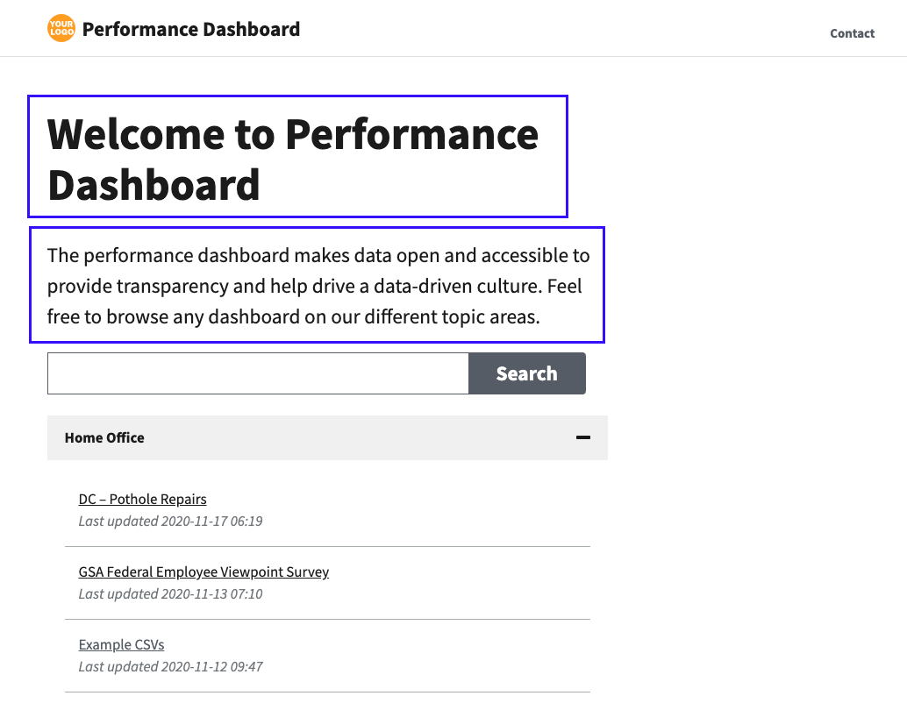
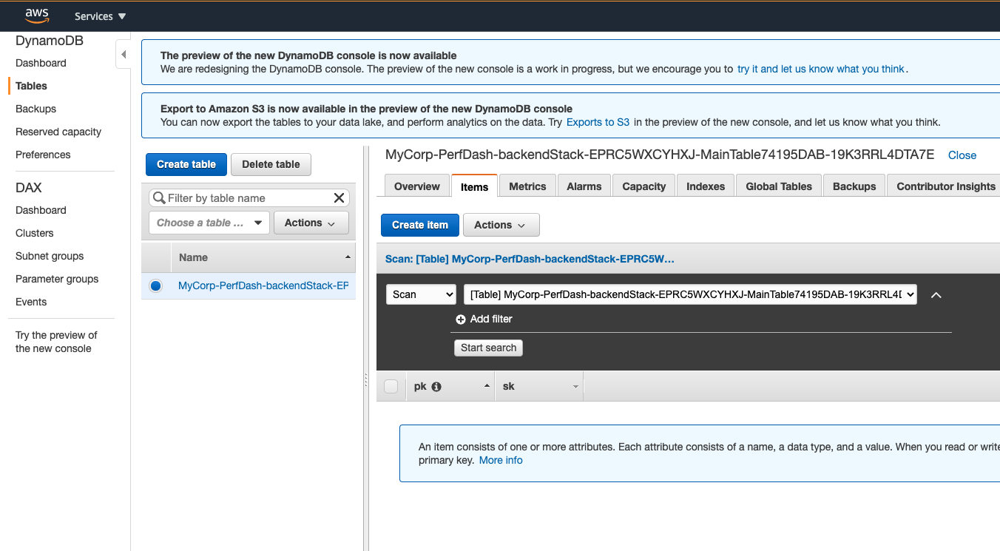
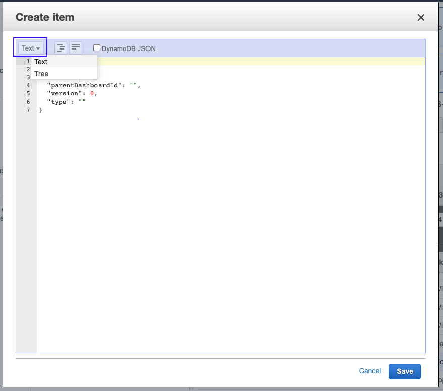
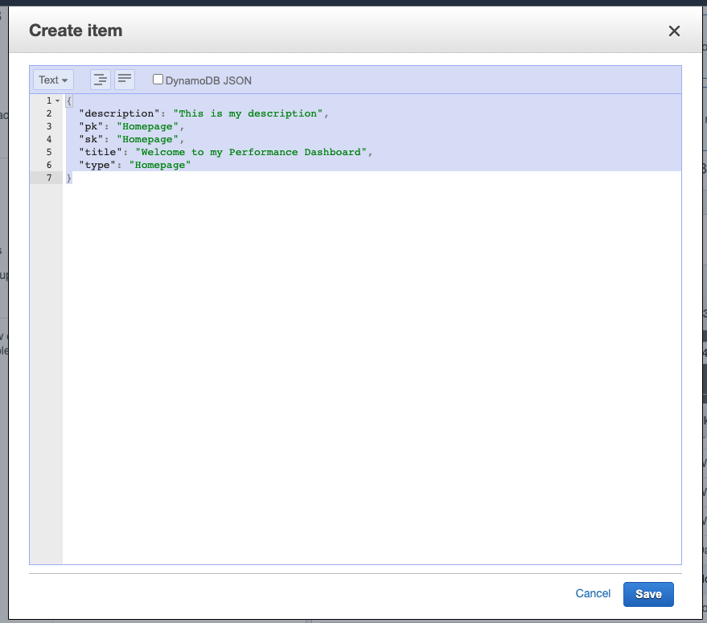

# Customizing the Frontend

The frontend application loads a set of environment variables from a file `env.js` that is created by a Custom Resource (Lambda function) that runs at deployment time in CloudFormation. This file can be found in the S3 bucket where the frontend code (HTML, JS, CSS) is deployed and it is loaded from CloudFront when a user visits the Performance Dashboard.

## Things that you can customize

- Topic area label
- Site name
- Contact email address
- Homepage title and description

## How to

The appropriate way to modify the values of the `env.js` file, is to change the environment variables of the Lambda Function (Custom Resource) that generates it. Follow these steps to do so:

1. Go to the Lambda console: https://console.aws.amazon.com/lambda/home in your AWS account. Make sure you are on the same AWS region where the Performance Dashboard is deployed. You should see several Lambda functions that start with the prefix `PerformanceDash-`.

2. Select the Lambda function that has a name like `PerformanceDash-{stage}-Frontend-EnvConfig`. You will see another Lambda function with a similar name like `PerformanceDash-{stage}-EnvConfigProviderframework`, that's not the one we are looking for. Select the one that doesn't have the word _Provider_.

3. Once you are inside the Lambda function, find the section where the Environment Variables are defined and click Edit. Modify their values as needed and save your changes.

4. Invoke the Lambda function by clicking the Test button in the console. You will be asked to provide a Test Event, enter any name you want for the test event, then copy and paste the following JSON input in the content area:

```json
{
  "RequestType": "Update"
}
```

5. Click the Test button to execute the Lambda function and you should get back a successful response. This means that a new `env.js` file was generated with the new values and uploaded to the S3 bucket.

6. Now, you need to invalidate the CloudFront distribution so that the old `env.js` file is removed from the CloudFront cache. Open the CloudFront console: https://console.aws.amazon.com/cloudfront.

7. Find the CloudFront distribution that has an Origin that starts with `performancedash-` and click on it.

8. Go to the Invalidations tab and click on the Create Invalidation button. In the `object-paths` input field, enter the following text, then click Invalidate.

```txt
/env.js
```

9. Wait a few minutes for CloudFront to finish invalidating the cache, and your new custom values should be reflected in the Performance Dashboard frontend.

## Customize the Homepage

The homepage is the first page that public users of PDoA see when they visit the website. You can customize the homepage title and description which are the ones highlighted in the image below:



To do so, open the DynamoDB Console: https://console.aws.amazon.com/dynamodb and navigate to the Tables item in the left Menu. You should see the main table for PDoA:



Click on the Create Item button. When the modal opens, switch to the Text view using the dropdown highlighted in the image below:



Copy and paste the following JSON content in the text area to replace the existing one. Write your desired `title` and `description` in the corresponding fields.

```json
{
  "description": "This is my description",
  "title": "Welcome to my Performance Dashboard",
  "pk": "Homepage",
  "sk": "Homepage",
  "type": "Homepage"
}
```

Click the Save button



That's all. Your changes should automatically be reflected in the Homepage.
