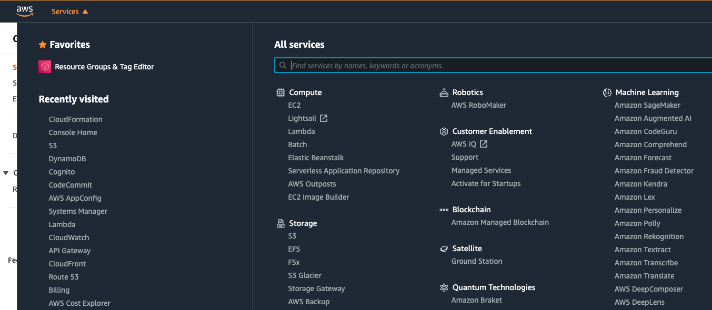
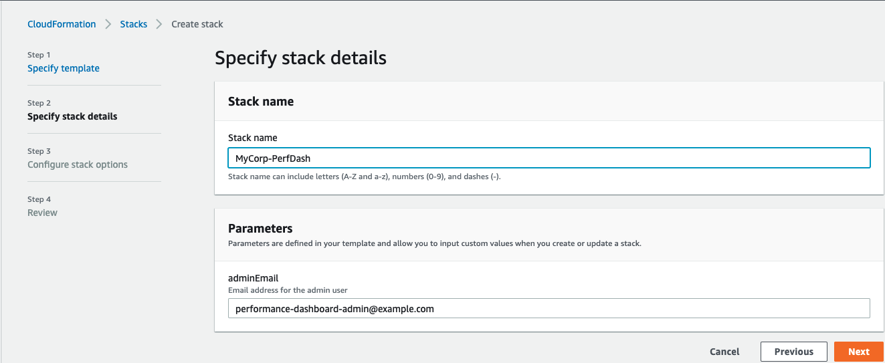
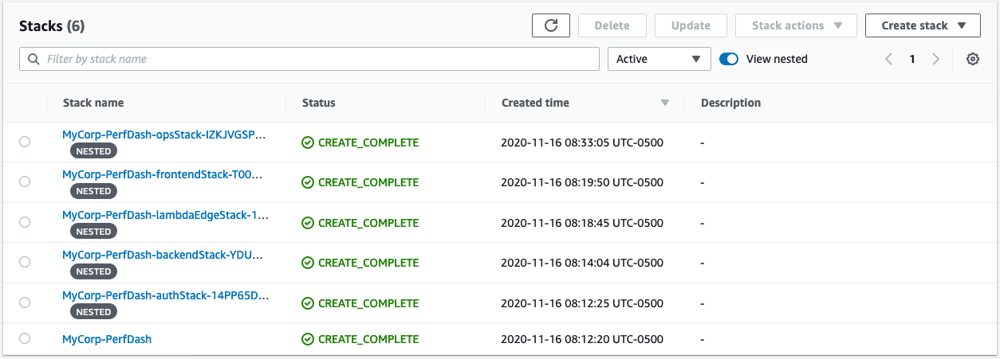
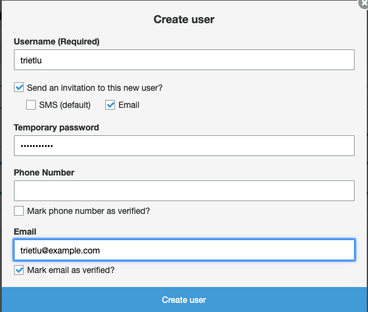
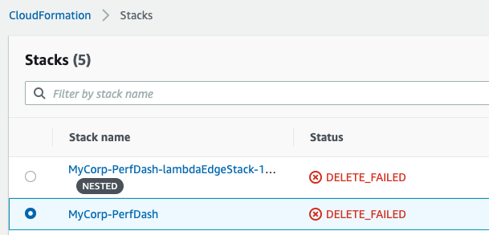

# Installing Performance Dashboard

Performance Dashboard on AWS (PDoA) comes with pre-built code to provision an instance in your AWS account. You can use the provided CloudFormation Template to install Performance Dashboard on AWS (PDoA) in a few clicks. If you're in a developer or techops role and want to update or experiment with the source code, the provided AWS Cloud Development Kit ([CDK](https://aws.amazon.com/cdk/)) script makes it easy to deploy your changes.

## Prerequisites

To deploy PDoA on AWS, you must have an AWS account, and have been granted permission to deploy resources. If you need to create and activate your account, follow these [instructions](https://aws.amazon.com/premiumsupport/knowledge-center/create-and-activate-aws-account/). You can [contact](https://aws.amazon.com/contact-us/) AWS to ask questions about setting up an account. In the instructions provided on this page, you will be asked to navigate to the AWS console for a particular service, such as the DynamoDB Console. If you're not familiar with the AWS console, you can click on the "Services" drop down to bring up a search bar where you can search for the console of a service.



## Deploying with AWS CloudFormation Template (CFT)

If you're not familiar with deploying resources on AWS using CFT, start by reviewing the CFT [FAQ](https://aws.amazon.com/cloudformation/faqs/). When you're ready to deploy, click the image below to deploy in the us-east-1 region:

| Region    | Launch                                                                                                                                                                                                                                                       |
| --------- | ------------------------------------------------------------------------------------------------------------------------------------------------------------------------------------------------------------------------------------------------------------ |
| us-east-1 | [](https://console.aws.amazon.com/cloudformation/home?region=us-east-1#/stacks/quickcreate?templateURL=https://performance-dashboard-on-aws-us-east-1.s3.amazonaws.com/performance-dashboard-us-east-1.json) |

You will be directed to the CloudFormation console on your browser. Enter the stack name such as "MyCorp-PerfDash", then check on the two "Capabilities" checkboxes at the bottom of the page. Press the "Create Stack" button. It will take about 25 minutes for the compute, storage, and database resources on AWS to be provisioned.



Once completed, you can see the stacks created in the CloudFormation console such as in the screenshot below. Click on the stacks to browse the AWS resources that were provisioned.



### Other regions

If you prefer to deploy PDoA in the us-west-2 or eu-west-2 region, you must first install a prerequisite stack into us-east-1, then complete the installation by deploying into the desired us-west-2 or eu-west-2 region. Please note that if you use the CDK method to install (described in the next [section](#Deploying-with-AWS-Cloud-Development-Kit)), you can choose to deploy into other regions besides us-east-1, us-west-2, or eu-west-2.

| Region                              | Launch                                                                                                                                                                                                                                                       |
| ----------------------------------- | ------------------------------------------------------------------------------------------------------------------------------------------------------------------------------------------------------------------------------------------------------------ |
| **Install this first in us-east-1** | [](https://console.aws.amazon.com/cloudformation/home?region=us-east-1#/stacks/quickcreate?templateURL=https://performance-dashboard-on-aws-us-east-1.s3.amazonaws.com/LambdaEdge-0.2.0-beta.json)             |
| us-west-2                           | [](https://console.aws.amazon.com/cloudformation/home?region=us-west-2#/stacks/quickcreate?templateURL=https://performance-dashboard-on-aws-us-west-2.s3.amazonaws.com/performance-dashboard-us-west-2.json) |
| eu-west-2                           | [](https://console.aws.amazon.com/cloudformation/home?region=eu-west-2#/stacks/quickcreate?templateURL=https://performance-dashboard-on-aws-eu-west-2.s3.amazonaws.com/performance-dashboard-eu-west-2.json) |

## Deploying with AWS Cloud Development Kit (CDK)

You can also use CDK to install PDoA. If you are updating the PDoA source code (e.g. for experimentation), you can use CDK to deploy your changes more easily than with CFT. The CDK code is the source of truth for creating the AWS application resources for PDoA. The CFT described earlier are generated from the CDK code.

This repository is a monorepo that includes 3 different applications: Backend, Frontend and CDK. The three of them are written in Typescript but each has its own set of dependencies (package.json) and they get built, packaged and deployed independently.

### Requirements

- [Node.js 12](https://nodejs.org/en/download)
- [Yarn](https://classic.yarnpkg.com/en/docs/install/#mac-stable)
- [AWS CDK](https://docs.aws.amazon.com/cdk/latest/guide/getting_started.html)
- [Git](https://git-scm.com/book/en/v2/Getting-Started-Installing-Git)
- [An AWS Account](https://aws.amazon.com/premiumsupport/knowledge-center/create-and-activate-aws-account/)

The following instructions assume that you have local AWS credentials in `~/.aws/credentials` file with IAM permissions to launch CloudFormation stacks.

### 1. Clone this repository

The mainline branch of this repository develops rapidly. If you want to obtain the latest stable copy of the code, clone this repository using the tag of the most recent release, which currently is 0.2.0-beta.

```bash
git clone -b 0.2.0-beta https://github.com/awslabs/performance-dashboard-on-aws.git
cd performance-dashboard-on-aws
```

Make the installation and deployment scripts executable:

```bash
chmod +x install.sh
chmod +x deploy.sh
chmod +x test.sh
```

Bootstrap AWS CDK for the first time in your AWS account by running the following commands:

```bash
# Need to bootstrap us-east-1 for Lambda@Edge
cdk bootstrap aws://AWS-Account-ID/us-east-1

# Also boostrap the region you plan to deploy to
cdk bootstrap aws://AWS-Account-ID/desired-region
```

### 2. Install

Run the install script to download npm dependencies.

```bash
./install.sh
```

(Optional) Run the unit tests to make sure everything is in order.

```bash
./test.sh
```

### 3. Deploy

The deploy script will use the AWS CDK to deploy 4 CloudFormation stacks named: `PerformanceDash-{env}-Backend`, `PerformanceDash-{env}-Frontend`, `PerformanceDash-{env}-Auth` and `PerformanceDash-{env}-Ops` where `{env}` is the environment name that you specify as parameter to the deployment script. By default, the stacks will be created in the AWS region that you have configured in your `~/.aws/config` file. If you want CDK to deploy to a specific region, you can set the environment variable `export AWS_REGION=us-west-2` before running the deployment script.

If this is the first time you deploy PDoA, you must also specify the desired email address for the Administrator user. You will receive an email invitation to login with a temporary password to this address, so make sure you specify a valid email:

```bash
# You only need to do this the first time you deploy.
export CDK_ADMIN_EMAIL=johndoe@example.com
```

Now, to deploy a `dev` environment for example, you may run the deployment script like so:

```bash
./deploy.sh dev
```

## Installation Completed

Once the installation has completed (whether using CFT or CDK), head to the AWS CFT console to view the resources and stacks created. If you're not familiar with using the CFT console, review the CFT [documentation](https://docs.aws.amazon.com/AWSCloudFormation/latest/UserGuide/cfn-console-view-stack-data-resources.html). In the CFT Console, click on "Stacks" to view the stacks created. Click on a created stack, then click on "Outputs" to view the resources created.

Let's get the web address of PDoA. On the CFT Console, click on the stack that has the string "frontendStack" as part of the name. For example, if you named your stack "MyCorp-PerfDash", then click on the stack with the prefix "MyCorp-PerfDash-frontendStack". Click on Outputs, and get the value for the key "CloudFrontURL" (e.g. something like <id>.cloudfront.net), which is the web address of PDoA. Type that web address into the browser, and you should land on the PDoA public homepage. There are no dashboards to view yet. To login to PDoA to create dashboards, add "/admin" to the web address, and go there. Before that however, we need to create the Editor users that you can use to login.

# Configuring Performance Dashboard on AWS

You can configure PDoA to tailor it to your environment, such as configuring it to use your DNS domain, adding users, customizing the home page logo, and more.

## Domain Name

You can use your domain name with PDoA. See the Installation Completed section above on how to get the web address of PDoA. Assign your domain name to that web address. If you don't already have a domain name, you can use [Amazon Route 53](https://aws.amazon.com/route53/) to host your domain.

## User Management

Out of the box, PDoA manages user identities in Amazon Cognito. A user login in to PDoA will be authenticated by Cognito. In a future release, PDoA will also support user identities managed in Active Directory. Before you begin use to PDoA, you must add the Editor users who will create and publish dashboards.

### Customize Email Invite

When you create a new user in the Performance Dashboard on AWS Amazon Cognito user pool, Cognito will send an email to invite that user to login to PDoA. A default invite email template is provided, which you can customize to suit your organization. You can customize the email template before you install PDoA, or after you have installed PDoA.

#### Pre installation

To customize the email template before installing PDoA, you will use CDK. Edit the file **cdk/lib/data/email-template-html** and make the changes below:

- Open **cdk/lib/data/email-template-html** in your editor
- Replace the placeholder values enclosed within "[]" with your own:
  - [Organization] - replace with your organization name
  - [Administrator] - replace with the name of person sending the invite
  - [your domain] - replace with the domain name you're using for Performance Dashboard. For example, change the placeholder value https://[your domain]/admin to https://example.com/admin. There are multiple instances of [your domain].
  - {username} and {####} - the username and temporary password created by Cognito. **Don't replace these, leave them as is**.

After making the edits, install your changes using CDK. See the section above on installing PDoA using CDK.

#### Post installation

If you wish to update the email template after installation, go to Cognito console. Click on the User Pool created for PDoA, then click on "Message customizations". Click on the "Email message" text box, enlarge the box, then make edits to the placeholder values as described above.

You can also update the logo used by the email. In the email template, look for the text src="https://[your domain]/logo.png", and replace it with the link to your logo. If you want to use the logo that comes with PDoA, get the link of that logo by opening a browser to PDoA. Right click on the logo on the PDoA public home page, and copy the link address. Paste that address into the email template to replace the placeholder logo.

### Adding Users

Go to the AWS Cognito Console, and click on Manage User Pools. Click on the User Pool created for PDoA, then click on "Users and groups". Enter the information requested as in the following dialog box:



An email will be sent to the email address you entered. The user will have to change the password when logging in for the first time.

Add a user for each editor you plan to have use PDoA, and add a user for the techops person.

## Manage Topic Areas

Topic areas are categories used to organize and group your dashboards. Before creating your first dashboard, you will have to create your topic areas. After you login to PDoA, click on Settings menu in the top navigation bar, then click on "Topic areas" in the left menu. You can create as many topic areas as you need to organize your dashboards.

## Replace Logo

You can replace the logo displayed on the PDoA web page header. Go to the S3 console, and look for a bucket that has "frontendstack" and "reactapp" as part of the name, such as "performancedash-beta-frontend-reactapp05daba0d-e5r481e3f18t". Click on that bucket, then on the folder "static", then on the folder "media". Look for an object with the name starting with "logo". Upload your logo to replace that object, be sure to use the same name as the logo that exists. For example, if the existing logo is named "logo.27a7fd8b.svg", when uploading your logo make sure to use that same name.

## Using PDoA

You have added the Editor users, and created the topic areas. You are now ready to use PDoA. Refer to the [User Guide](user-guide.pdf) for information on using PDoA to create and publish dashboards.

## Uninstall PDoA

### Uninstall using CFT

If you deployed using CFT, go to the CFT console and delete the stacks that were stood up. Look for the name you used when creating the stack, such as "MyCorp-PerfDash". Delete the top level stack, which will also delete the nested stacks. The top level stack is the one not marked "nested". When deleting the stack you may encounter an error with deleting the LambdaEdge nested stack (the other nested stacks should have been deleted successfully). If this occurs, wait an hour, then try to delete again. Lambda@Edge functions are created with replicas, and it takes some time before all the replicas are [deleted](https://docs.aws.amazon.com/AmazonCloudFront/latest/DeveloperGuide/lambda-edge-delete-replicas.html).



### Uninstall using CDK

If you deployed using CDK, you can use the `cdk destroy` command to uninstall PDoA. Remember to set the environment variable CDK_ENV_NAME to the value used when you ran `deploy.sh`. For example if you ran `deploy.sh dev`, then set `CDK_ENV_NAME=dev`.
