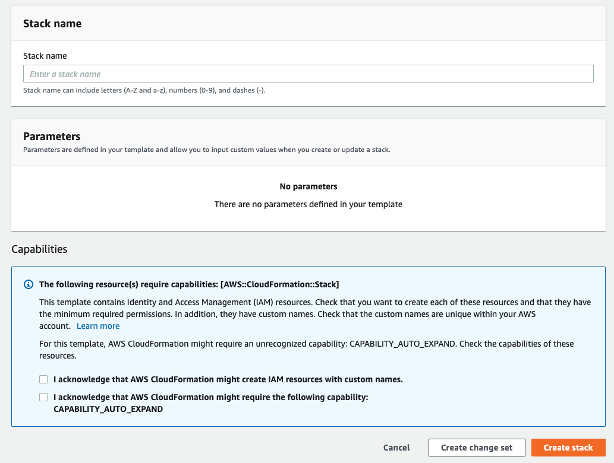
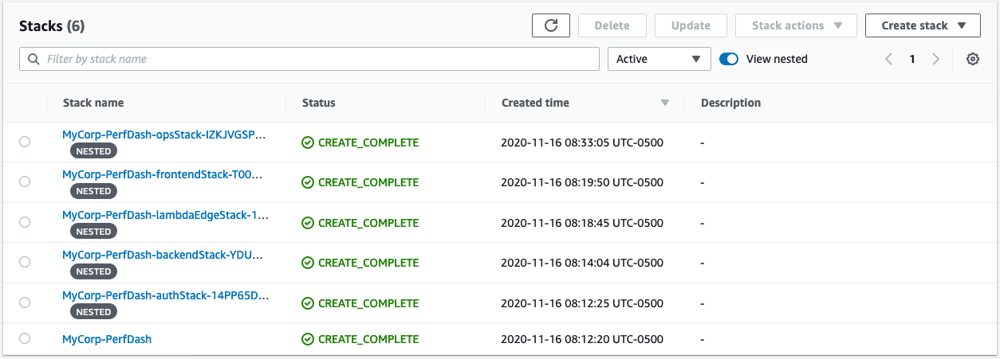
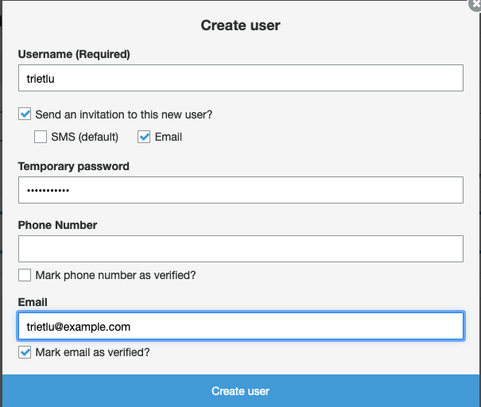

# Installing Performance Dashboard

Performance Dashboard on AWS (PDoA) comes with pre-built code to provision an instance in your AWS account. You can use the provided CloudFormation Template to install Performance Dashboard on AWS (PDoA) in a few clicks. If you're in a developer or techops role and want to update or experiment with the source code, the provided AWS Cloud Development Kit ([CDK](https://aws.amazon.com/cdk/)) script makes it easy to deploy your changes.

## Prerequisites

To deploy PDoA on AWS, you must have an AWS account. If you need to create and activate your account, follow these [instructions](https://aws.amazon.com/premiumsupport/knowledge-center/create-and-activate-aws-account/).

## Deploying with AWS CloudFormation Template (CFT)

If you're not familiar with deploying resources on AWS using CFT, start by reviewing the CFT [FAQ](https://aws.amazon.com/cloudformation/faqs/). When you're ready to deploy, click the image below to deploy in the us-east-1 region:

Install in us-east-1 [](https://console.aws.amazon.com/cloudformation/home?region=us-east-1#/stacks/quickcreate?templateURL=https://performance-dashboard-on-aws-us-east-1.s3.amazonaws.com/performance-dashboard-us-east-1.json)

You will be directed to the CloudFormation console on your browser. Enter the stack name such as "MyCorp-PerfDash", then check on the two "Capabilities" checkboxes at the bottom of the page. Press the "Create Stack" button. It will take about 25 minutes for the resources to be provisioned.



Once completed, you can see the stacks created in the CloudFormation console such as in the screenshot below. Click on the stacks to browse the AWS resources that were provisioned.



### Other regions

If you prefer to deploy PDoA in the us-west-2 or eu-west-2 region, you must first install a prerequisite stack into us-east-1, then complete the installation by deploying into the desired us-west-2 or eu-west-2 region.

**Install prereq first** [](https://console.aws.amazon.com/cloudformation/home?region=us-east-1#/stacks/quickcreate?templateURL=https://performance-dashboard-on-aws-us-east-1.s3.amazonaws.com/LambdaEdge-1.0-b.0.json)

Install in us-west-2 [](https://console.aws.amazon.com/cloudformation/home?region=us-west-2#/stacks/quickcreate?templateURL=https://performance-dashboard-on-aws-us-west-2.s3.amazonaws.com/performance-dashboard-us-west-2.json)

Install in eu-west-2 [](https://console.aws.amazon.com/cloudformation/home?region=eu-west-2#/stacks/quickcreate?templateURL=https://performance-dashboard-on-aws-eu-west-2.s3.amazonaws.com/performance-dashboard-eu-west-2.json)

## Deploying with AWS Cloud Development Kit (CDK)

You can also use CDK to install PDoA. If you are updating the PDoA source code (e.g. for experimentation), you can use CDK to deploy your changes more easily than with CFT. The CDK code is the source of truth for creating the AWS application resources for PDoA. The CFT described earlier are generated from the CDK code.

This repository is a monorepo that includes 3 different applications: Backend, Frontend and CDK. The three of them are written in Typescript but each has its own set of dependencies (package.json) and they get built, packaged and deployed independently.

### Requirements

- [Node.js 12](https://nodejs.org/en/download)
- [Yarn](https://classic.yarnpkg.com/en/docs/install/#mac-stable)
- [AWS CDK](https://docs.aws.amazon.com/cdk/latest/guide/getting_started.html)
- [Git](https://git-scm.com/book/en/v2/Getting-Started-Installing-Git)
- [An AWS Account](https://aws.amazon.com/premiumsupport/knowledge-center/create-and-activate-aws-account/)

The following instructions assume that you have local AWS credentials in `~/.aws/credentials` file with IAM permissions to launch CloudFormation stacks.

### 1. Clone this repository

```bash
git clone https://github.com/awslabs/performance-dashboard-on-aws.git
cd performance-dashboard-on-aws
```

Make the installation and deployment scripts executable:

```bash
chmod +x install.sh
chmod +x deploy.sh
chmod +x test.sh
```

Bootstrap AWS CDK for the first time in your AWS account by running the following commands:

```bash
# Need to bootstrap us-east-1 for Lambda@Edge
cdk bootstrap aws://AWS-Account-ID/us-east-1

# Also boostrap the region you plan to deploy to
cdk bootstrap aws://AWS-Account-ID/desired-region
```

### 2. Install

Run the install script to download npm dependencies.

```bash
./install.sh
```

(Optional) Run the unit tests to make sure everything is in order.

```bash
./test.sh
```

### 3. Deploy

The deploy script will use the AWS CDK to deploy 4 CloudFormation stacks named: `PerformanceDash-{env}-Backend`, `PerformanceDash-{env}-Frontend`, `PerformanceDash-{env}-Auth` and `PerformanceDash-{env}-Ops` where `{env}` is the environment name that you specify as parameter to the deployment script. By default, the stacks will be created in the AWS region that you have configured in your `~/.aws/config` file. If you want CDK to deploy to a specific region, you can set the environment variable `export AWS_REGION=us-west-2` before running the deployment script.

To create a `dev` environment for example, you may run the deployment script like so:

```bash
./deploy.sh dev
```

## Installation Completed

Once the installation has completed (whether using CFT or CDK), head to the AWS CFT console to view the resources and stacks created. If you're not familiar with navigating the CFT console, review the CFT [documentation](https://docs.aws.amazon.com/AWSCloudFormation/latest/UserGuide/cfn-console-view-stack-data-resources.html). In the CFT Console, click on "Stacks" to view the stacks created. Click on a created stack, then click on "Outputs" to view the resources created. Later, you will need the identifiers of the resources created to configure PDoA.

# Configuring Performance Dashboard

You can configure PDoA to tailor it to your environment, such as configuring it to use your DNS domain, adding users, customizing the home page logo, and more.

## Domain Name

You can use your domain name with PDoA. To get the web address of PDoA, go to the CFT Console, and click on the stack that has the string "frontendStack". For example, if you named your stack "MyCorp-PerfDash", then click on the stack with the prefix "MyCorp-PerfDash-frontendStack". Click on Outputs, and get the value for the key "CloudFrontURL" (e.g. something like <id>.cloudfront.net), which is the web address of PDoA. Assign your domain name to that web address. If you don't already have a domain name, you can use [Amazon Route 53](https://aws.amazon.com/route53/) to host your domain.

## User Management

Before you can use PDoA, you must first add the Editor users who will create and publish dashboards. Out of the box, PDoA manages user identities in Amazon Cognito. A user login in to PDoA will be authenticated by Cognito. In a future release, PDoA will also support user identities managed in Active Directory.

### Customize Email Invite

When you create a new user in the Performance Dashboard Amazon Cognito user pool, Cognito will send an email to invite that user to login to Performance Dashboard. A default invite email template is provided, which you can customize to suit your organization. You can customize the email template before you install PDoA, or after you have installed PDoA.

#### Pre installation

To customize the email template before installing PDoA, you will use CDK. Edit the file **cdk/lib/data/email-template-html** and make the changes below:

- Open **cdk/lib/data/email-template-html** in your editor
- Replace the placeholder values enclosed within "[]" with your own:
  - [Organization] - replace with your organization name
  - [Administrator] - replace with the name of person sending the invite
  - [your domain] - replace with the domain name you're using for Performance Dashboard. For example, change the placeholder value https://[your domain]/admin to https://example.com/admin
  - {username} and {####} - the username and temporary password created by Cognito. Don't replace these, leave them as is

After making the edits, install your changes using CDK. See the section above on installing PDoA using CDK.

#### Post installation

If you wish to update the email template after installation, go to Cognito console. Click on the User Pool created for PDoA, then click on "Message customizations". Click on the "Email message" text box, enlarge the box, then make edits to the placeholder values as described above.

### Adding Users

Go to the AWS Cognito Console, and click on Manage User Pools. Click on the User Pool created for PDoA, then click on "Users and groups". Enter the information requested as in the following dialog box:



An email will be sent to the email entered. The user will have to change the password when loggin in for the first time.

Add a user for each editor you plan to have use PDoA, and add a user for the techops person.

## Manage Topic Areas

In a future release, PDoA will have an Admin UI for you to manage topic areas. For now, you will edit topic areas directly in the database.

### Create a New Topic Area

Dashboards are grouped by topic areas. Before creating your first dashboard, you will have to create your topic areas. For now, you will create the topic area directly in the AWS DynamoDB table used by PDoA. To begin, go to the AWS DynamoDB console, click on the Tables tab, then on the table with the prefix "PerformanceDash". In the right panel, click on the Items tab.


Next, click on the "Create item" blue button. You will be presented with a dialog box to compose the entry to be added to the table. For the "pk" and "sk" fields, enter the identifier "8db2aafa-f6db-41ac-bf07-403b18c2dd46". For the "type" field, enter "TopicArea". You now must add two new fields called "createdBy" and "name". To add a field, click on the "+" symbol, then on "Append", then on "String".


Enter "createdBy" for the field, and the Cognito user name for the user who's creating the entry. Repeat for the "name" field, and enter the topic area name, such as "Ministry of Finance"


Repeat the steps above for every topic area that you need to add. For the "pk" and "sk" fields, vary the identifier above by a digit, such as changing "8db2aafa-f6db-41ac-bf07-403b18c2dd46" to "8db2aafa-f6db-41ac-bf07-403b18c2dd4**7**"

### Rename a Topic Area

To rename an existing topic area, go to the Amazon DynamoDB console, and open the table with the prefix "PerformanceDash". Look for the topic area that you wish to rename by filtering the type "TopicArea". Edit the entry to change the name of the topic area.

### Delete a Topic Area

Before deleting a topic area, make sure you delete all dashboards associated with that topic area first. As in renaming a topic area above, find your topic area entry in DynamoDB. Delete that entry to delete the topic area.
