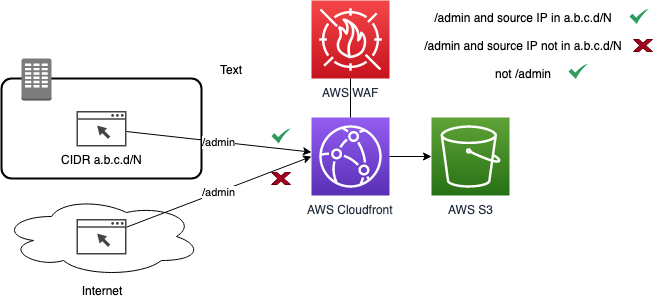

# Limiting access to on-premises networks only

By default, Performance Dashboard is configured to allow access from the Internet.  This include Editors who can create and publish dashboards, and public users who can view the dashboards.  To remove the threat of attackers from the Internet attempting to access the administrative functions of Performance Dashboard, you can configure it to only allow access to the **/admin** path to come from your on-premises network.  In the same manner, you can also limit access to the entire application to only from your on-premises network.

## Preventing access with AWS WAF

You can use the [AWS WAF](https://aws.amazon.com/waf/) to limit access to Performance Dashboard to requests originating in your on-premises network.  You create a [Web ACL](https://docs.aws.amazon.com/waf/latest/developerguide/web-acl.html) to allow or block requests based on the IP addresses that the requests originate from.  You then protect the CloudFront distribution used with Performance Dashboard with that WebACL.  The diagram below shows the concept:



## Configuring the WAF

In a future release of Performance Dashboard, as part of the automated installation, you will be able to specify whether you want to limit access to Performance Dashboard to certain IP addresses.  For now, you can manually create the AWS WAF Web ACL and associate it with the Performance Dashboard CloudFront distribution.  Refer to AWS documentation in the links below to understand the steps for configuring the Web ACL in the AWS WAF console:

* [Creating a web ACL](https://docs.aws.amazon.com/waf/latest/developerguide/web-acl-creating.html)
* Use an [IP set match](https://docs.aws.amazon.com/waf/latest/developerguide/waf-rule-statement-type-ipset-match.html) to inspect the IP address of a web request against a set of IP addresses and address ranges. Use this to allow or block web requests based on the IP addresses that the requests originate from
* Use a [String match rule statement](https://docs.aws.amazon.com/waf/latest/developerguide/waf-rule-statement-type-string-match.html) to indicate the string that you want AWS WAF to search for in a request, where in the request to search.  Use this to allow or block web requests based on a string pattern in the URI, such as /admin

To create the Web ACL as described in the diagram above, you can run the Cloud Formation Template (CFT) below in the us-east-1 region.  Change the CIDR ranges to that of your internal network.  After running the CFT to create the Web ACL, go to the CloudFront console, and configure the [AWS WAF Web ACL](https://docs.aws.amazon.com/AmazonCloudFront/latest/DeveloperGuide/distribution-web-awswaf.html) field of the Performance Dashboard CloudFront distribution with the Web ACL you just created.

```
{
    "Resources": {
      "StackPerformanceDashboardEnterpriseOnly": {
        "Type": "AWS::WAFv2::WebACL",
        "Properties": {
          "DefaultAction": {
            "Allow": {}
          },
          "Scope": "CLOUDFRONT",
          "VisibilityConfig": {
            "CloudWatchMetricsEnabled": true,
            "MetricName": "EnterpriseOnly",
            "SampledRequestsEnabled": true
          },
          "Description": "EnterpriseOnly",
          "Name": "PerformanceDashboardEnterpriseOnly",
          "Rules": [
            {
              "Action": {
                "Allow": {}
              },
              "Name": "AdminFromEnterprise",
              "Priority": 1,
              "Statement": {
                "AndStatement": {
                  "Statements": [
                    {
                      "IPSetReferenceStatement": {
                        "Arn": {
                          "Fn::GetAtt": [
                            "InternalOnlyIPV4",
                            "Arn"
                          ]
                        }
                      }
                    },
                    {
                      "ByteMatchStatement": {
                        "FieldToMatch": {
                          "UriPath": {}
                        },
                        "PositionalConstraint": "CONTAINS",
                        "SearchString": "/admin",
                        "TextTransformations": [
                          {
                            "Priority": 0,
                            "Type": "NONE"
                          }
                        ]
                      }
                    }
                  ]
                }
              },
              "VisibilityConfig": {
                "CloudWatchMetricsEnabled": true,
                "MetricName": "AdminFromEnterprise",
                "SampledRequestsEnabled": true
              }
            },
            {
              "Action": {
                "Block": {}
              },
              "Name": "AdminNotFromEnterprise",
              "Priority": 2,
              "Statement": {
                "AndStatement": {
                  "Statements": [
                    {
                      "ByteMatchStatement": {
                        "FieldToMatch": {
                          "UriPath": {}
                        },
                        "PositionalConstraint": "CONTAINS",
                        "SearchString": "/admin",
                        "TextTransformations": [
                          {
                            "Priority": 0,
                            "Type": "NONE"
                          }
                        ]
                      }
                    },
                    {
                      "NotStatement": {
                        "Statement": {
                          "IPSetReferenceStatement": {
                            "Arn": {
                              "Fn::GetAtt": [
                                "InternalOnlyIPV4",
                                "Arn"
                              ]
                            }
                          }
                        }
                      }
                    }
                  ]
                }
              },
              "VisibilityConfig": {
                "CloudWatchMetricsEnabled": true,
                "MetricName": "AdminNotFromEnterprise",
                "SampledRequestsEnabled": true
              }
            },
            {
              "Action": {
                "Allow": {}
              },
              "Name": "PublicPage",
              "Priority": 3,
              "Statement": {
                "NotStatement": {
                  "Statement": {
                    "ByteMatchStatement": {
                      "FieldToMatch": {
                        "UriPath": {}
                      },
                      "PositionalConstraint": "CONTAINS",
                      "SearchString": "/admin",
                      "TextTransformations": [
                        {
                          "Priority": 0,
                          "Type": "NONE"
                        }
                      ]
                    }
                  }
                }
              },
              "VisibilityConfig": {
                "CloudWatchMetricsEnabled": true,
                "MetricName": "PublicPage",
                "SampledRequestsEnabled": true
              }
            }
          ]
        },
        "DependsOn": [
          "InternalOnlyIPV4"
        ]
      },
      "InternalOnlyIPV4": {
        "Type": "AWS::WAFv2::IPSet",
        "Properties": {
          "Addresses": [
            "1.1.0.0/16",
            "2.2.0.0/16"
          ],
          "IPAddressVersion": "IPV4",
          "Scope": "CLOUDFRONT",
          "Description": "This is the WAF v2 IPSet designating the CIDR of the internal network",
          "Name": "InternalOnly_Performance_Dashboard"
        }
      }
    }
  }

```


