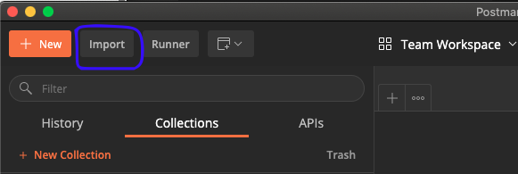
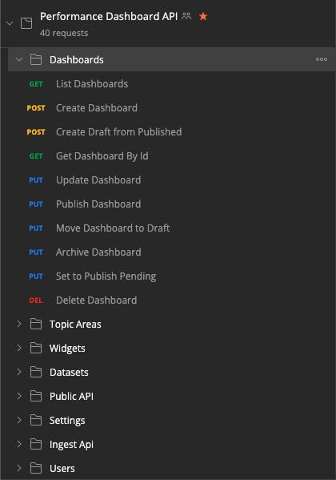
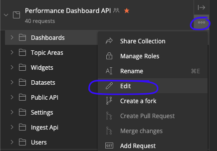
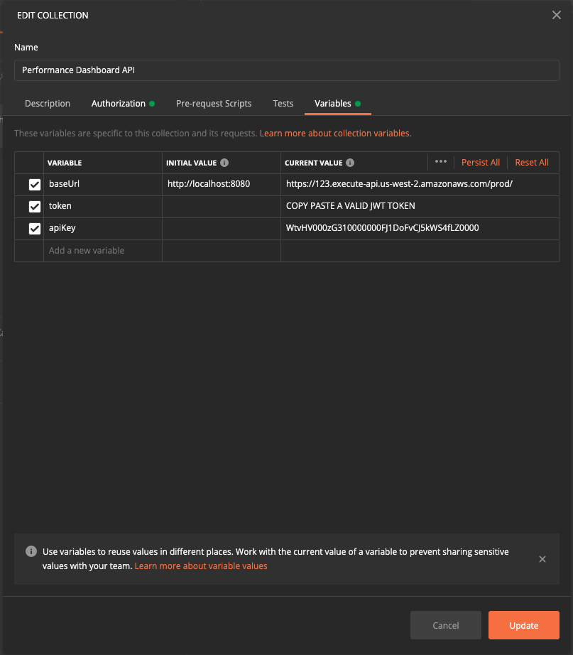
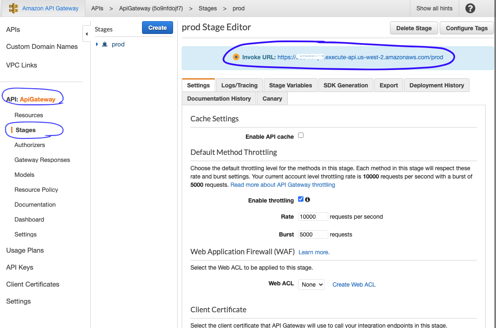
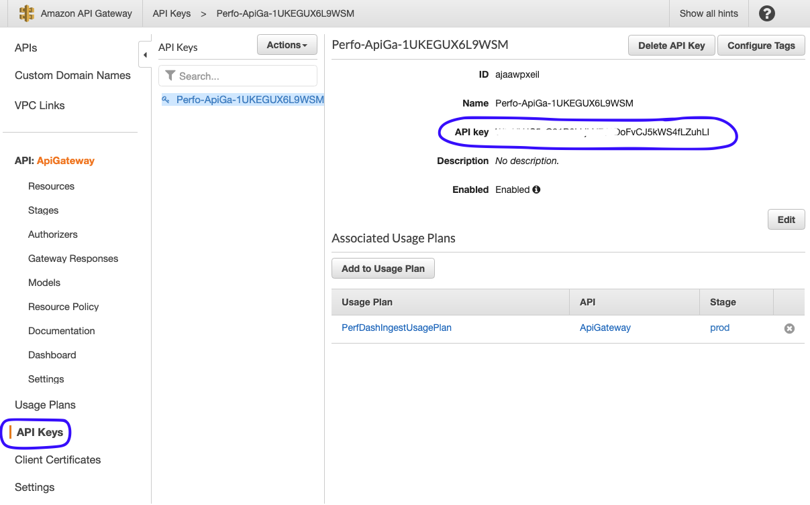
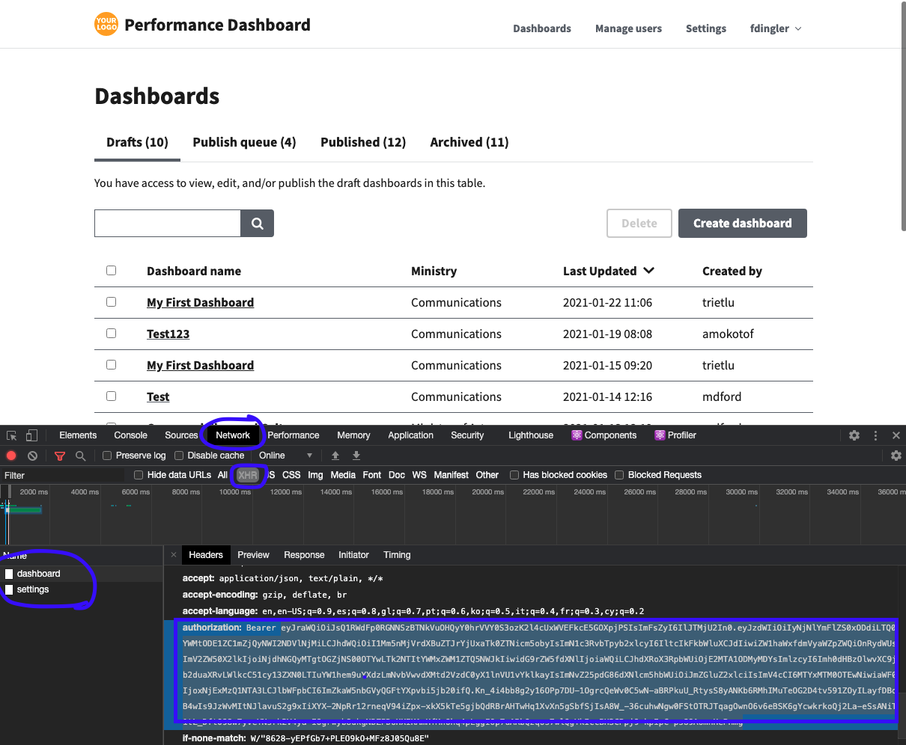
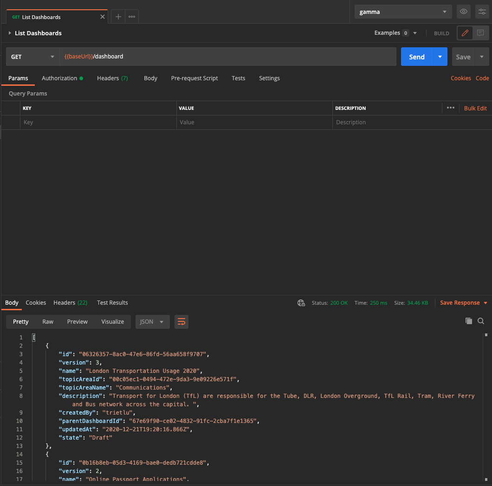

# Postman Collection for PDoA

Postman is an application that lets you create HTTP requests that you can reuse and share with your team.
We provide a Postman collection containing all the routes of the Performance Dashboard on AWS API. If you don't use Postman yet, you can download it from [here](https://www.postman.com/downloads/). It's free and available for many operating systems.

## How to import the collection

Download our Postman collection from [here](https://github.com/awslabs/performance-dashboard-on-aws/tree/mainline/backend/postman) and then click the Import button in Postman as shown in the screenshot below:

Select the JSON file you downloaded and import it. You should see the collection now in your Postman application:

## Configure the collection

Once you have imported the Postman collection, you will need to configure a couple of environment variables like the URL of your API, the JWT token variable and the API Key.

Then specify values for the following environment variables:

The `baseUrl` variable is the URL of the Amazon API Gateway URL that got created after deploy PDoA in your AWS account. You can get it by accessing the [API Gateway console](https://console.aws.amazon.com/apigateway/home).

The `apiKey` variable is the Amazon API Gateway API Key that got generated when you deployed PDoA in your account. You can get it by accessing the [API Gateway console](https://console.aws.amazon.com/apigateway/home) and going to the API Keys section.

Finally, the `token` variable is the JWT token that Amazon Cognito provides when you login into the PDoA user interface. A quick way to get a valid token is to inspect the network requests in your browser and get the token from the Authorization header. For example, in the following screenshot, the token is the long string after the word `Bearer`.

## Using the Postman collection

Once you have configured your collection, you can start invoking the API by choosing any request from the collection and clicking the Send button.

