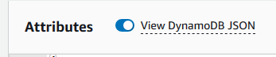

## How examples are inserted into the app.

The insert script requires the following parameters

- tableName - the name of the dynamo db table to store entities in. This is DynamoDbTableName in CloudFormation.
- examples - the name of the examples bucket where the examples files are stored. This is ExamplesStorageBucket in CloudFormation.
- datasets - the name of the datasets bucket where uploaded files are stored. This is DatasetsBucketName in CloudFormation.
- userEmail - the name of the use to be used for created by in examples. This is the same as the adminEmail. Passed in through adminEmail CloudFormation Patameter.
- language - the name of the language to be used for examples. Defaults to english. Passed in through exampleLanguage CloudFormation Patameter.

When the scripts runs through the cli or the lambda it looks for these parameters in environment variables.

- EXAMPLE_TABLENAME,
- EXAMPLE_EXAMPLESBUCKET,
- EXAMPLE_DATASETBUCKET,
- EXAMPLE_USEREMAIL,
- EXAMPLE_LANGUAGE

Script Codeflow

1. Query examples bucket for all files in the language directory
2. By filename and path build a list of examples with widgets
3. Itterate over examples.

   1. Save TopicArea
   2. Save Dashboard
   3. For each widget, save widget and copy data files from examples bucket to dataset bucket

## Debug Locally

You can debug locally by running `/examples/setupexample-lambda/cli.js`

.vscode/launch.json

```
    "version": "0.2.0",
    "configurations": [
        {
            "type": "node",
            "request": "launch",
            "name": "Launch Program",
            "skipFiles": [
                "<node_internals>/**"
            ],
            "program": "${workspaceFolder}\\examples\\setupexample-lambda\\cli.js",
            "outFiles": [
                "${workspaceFolder}/examples/setupexample-lambda/*.js"
            ],
            "envFile": "${workspaceFolder}/.vscode/.env",
        }
    ]
}
```

.vscode/.env

```
EXAMPLE_TABLENAME=
EXAMPLE_EXAMPLESBUCKET=
EXAMPLE_DATASETBUCKET=
EXAMPLE_USEREMAIL=
EXAMPLE_LANGUAGE=

# AWS CLI Credentials
AWS_ACCESS_KEY_ID=
AWS_SECRET_ACCESS_KEY=
AWS_SESSION_TOKEN=

```

### Tests

Tests can be run with `npm run test` or `npm run test:ci`

### File Structure

#### Expected file structure

```
examples/
    examplesfiles/
        <language>/
            <example>/
                dashboard.json
                topicarea.json
                widgets/
                    <widget>.json
                datasets/
                    <dataset for widget>.json
                data/
                    <data for widget>.json
                    <data for widget>.csv

```

#### Example file structure

```
examples/
    examplesfiles/
        english/
            dashboard1
                dashboard.json
                topicarea.json
                widgets/
                    barchart.json
                    coffee.json
                datasets/
                    barchart.json
                    coffee.json
                data/
                    barchart.json
                    barchart.csv
                    coffee.json
                    coffee.csv

```

## Current Limitations / Design

- Example directories `<example>`, can have have any name.
- One dashboard and topic area per example directory. This was done for setup simplcity.
- Widgets, datasets and data files are keyed together by name but it can be any name. Looking at the example structure above. There is a matching filename in `coffee` in widgets, datasets, and data.
- The relationship between datafiles and widgets is one to one. If a data files need to be used for multiple widgets then copy the files and change the name of the copy to match the widget. This was done for setup simplcity.

## Exporting a Dashboard

Add your example files to the desired language directory. `examples/examplefiles/<desired language>/<your new example>`
If you are adding a new language, the name of the laguage folder will be the key used to select the language during deployment.

### Steps

1. Get the dashboard id from url `/admin/dashboard/<dashboard id>/`
2. Find the dashboard board in Dynammo DB PK and SK will equal `Dashboard#<dashboard id>`.
3. Export the dashboard as json.View as Json. Set View as DynamoDB JSON to on. Copy the JSON and save to text file. dashboard.json.



4. Copy TopicareaId in dashboard.json and export the topicarea to topicarea.json. PK and SK will equal `TopicArea#<topicarea id>`.
5. Find all of the widgets for the dashboard and export the json. PK will equal `Dashboard#<dashboard id>` and SK will start with `Widget#`.
6. For each widget that is a chart export the dataset. In the widget json there is a field `datasetId`. You can find the data set with PK AND SK will equal `Dataset#<dataset id>`
7. Download the data sets from s3. Go to the -datasets s3 bucket /public folder.
8. Find the datasets using the s3 keys found in the dataset.json and download the json and csv.
9. For each file downloaded, go through each file and delete the ids and user names.

If you need to export only a chart to add to an existing example. If you can find the id from the edit page for the chart `admin/dashboard/<dashboard id>/edit-chart/<widget id>`. Then you can follow steps 5 through 9.
